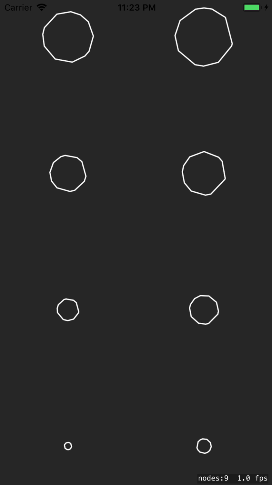

# Asteroid-Test

This test project is used to test ideas for the Astervoids Game.

Class: AsteroidRender

Draws an asteroid as a multisided polygon using an SKShapeNode. 

- Set the fill and strokecolors
- Returning a UIImage might be more efficient than using SKShapeNode
  - Use a method to render a UIImage from a path
 - Create asteroid shapes that represent damaged asteroids
  - the outline will be more jagged or have cracks
  
 
